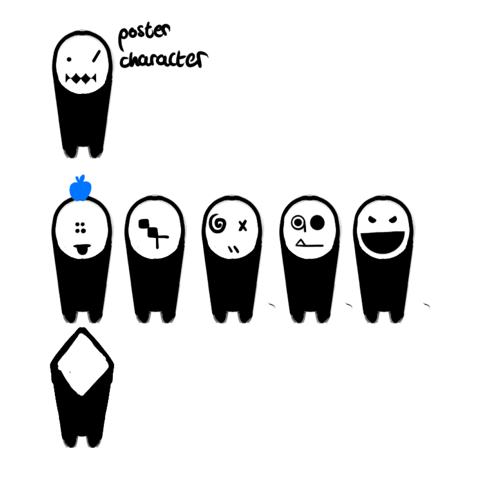

# WEB PET *proof of concept*

*The prototype explores how a player will create, customise, and interact with a companion through a web interface. It focuses on testing the main gameplay idea rather than presenting a complete game!*

## Proof of Concept

WEB PET is a browser-based, isometric, character driven game.

The player will be able to interact with a character, interact with their basic needs and mood, and make changes to their appearance or environment.

## Concept

WEB PET is inspired by virtual-pet games, life simulators, social games, and creator-focused games such as:

- *Tomodachi Life* (Video Reference)
- *Tamagotchi* (Physical Reference)
- *PewDiePie’s Tuber Simulator* (Physical Reference)
- *Club Penguin / Club Penguin Journey* (Physical Reference)

The prototype will use these ideas as general inspiration while developing its own original character, setting, artwork, and interfaces.

## Prototype Features

The proof of concept will focus on a small number of core features:

- Creating a character
- Viewing the character in their environment / their UI element
- Interacting with the character
- Changing simple character values
- Displaying character reactions
- Customising parts of the character or room
- Testing a basic reward or progression system

The purpose of these features is to demonstrate how the main interaction loop could work.

## Interaction Loop

The current concept is based around a simple repeating loop:

1. The player opens the game.
2. The player views their virtual character.
3. The player chooses an event.
4. The character reacts to the interaction.
5. Character values change.
6. The player continues interacting or returns later.

The prototype will use this loop to test whether the game feels clear, engaging, and easy to use.

## Character

The character is the main focus of the prototype. The player will be able to view the character and interact with them through a small number of actions.

The character will have basic values such as:

- Mood
- Energy
- Hunger
- Hygiene

These values are included to demonstrate how the character would respond to players' actions. subject for dev.

## Environment

The character will be placed in a simple room or personal space. The room is included to test how an interactive environment could support the character and the game interface.

The prototype may include a small selection of:

- Furniture
- Decorations
- Background elements
- Interactive objects

The environment does not need to be fully customisable in the first version. It will mainly demonstrate the visual style and possible direction of the game.

## Visual Direction

The prototype will use a simple, friendly, visual style. The main focus will be on making the character, buttons, and interactions easy to understand.

The visual design would include:

- A clear character display
- Simple menus
- Expresive reaction
- A readable interface
- Basic room decoration

The final appearance will develop through concept art and prototype testing.

## Concept Art

*Early prototype of the WEB PET.*

## Current Scope

The first version will focus on:

- One character
- One environment
- A small selection of interactions
- Basic character values
- Simple reactions
- Limited customisation
- A basic interface

## Software

WEB PET is being created with:

- HTML
- CSS
- JavaScript
